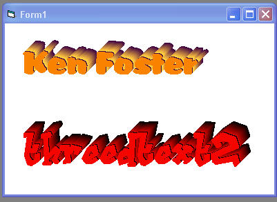



## Transparent 3D Label UserControl \(Updated\)

### Description

I've made one of my earlier submissions (3D Text)into a Transparent usercontrol. Hope it is useful.As of 9/11/05 added update.Added some more properties (X offset,Y offset and depth) and resizing of control.
 
### More Info
 

             |
---                |---
**Submitted On**   |2005-09-11 17:03:10
**By**             |[Kenneth Foster](https://github.com/Planet-Source-Code/PSCIndex/blob/master/ByAuthor/kenneth-foster.md)
**Level**          |Intermediate
**User Rating**    |4.9 (39 globes from 8 users)
**Compatibility**  |VB 6\.0
**Category**       |[Custom Controls/ Forms/  Menus](https://github.com/Planet-Source-Code/PSCIndex/blob/master/ByCategory/custom-controls-forms-menus__1-4.md)
**World**          |[Visual Basic](https://github.com/Planet-Source-Code/PSCIndex/blob/master/ByWorld/visual-basic.md)
**Archive File**   |[Transparen1931969112005\.zip](https://github.com/Planet-Source-Code/kenneth-foster-transparent-3d-label-usercontrol-updated__1-62495/archive/master.zip)

